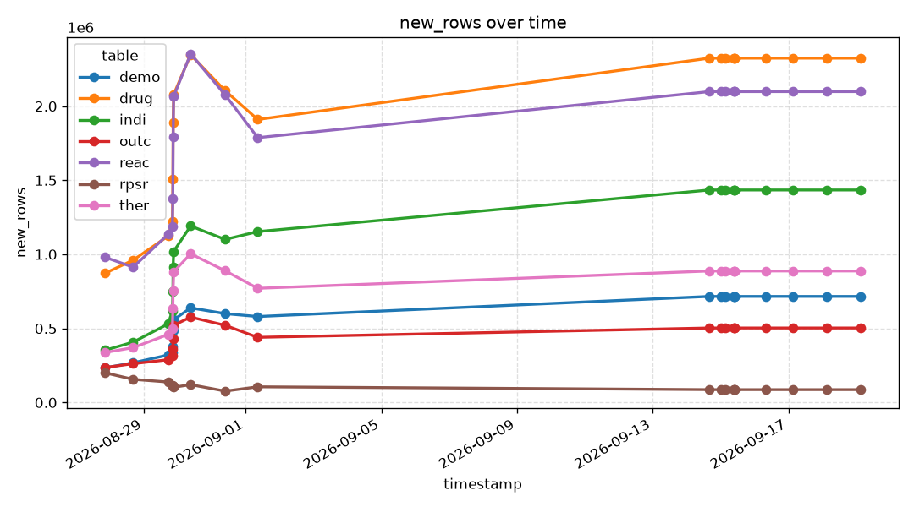
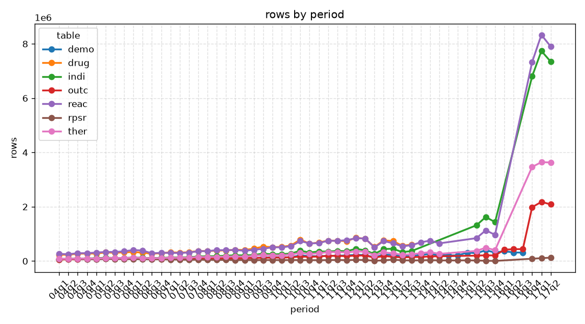

# tgedr-fdafaers


[](https://pypi.org/project/tgedr-fdafaers/)


## data pipeline metrics

### new rows



### rows per period



## development
- main requirements:
  - _uv_  
  - _bash_
- Clone the repository like this:

  ``` bash
  git clone git@github.com:jtviegas/fda_faers
  ```
- cd into the folder: `cd fda_faers`
- install requirements: `./helper.sh reqs`
